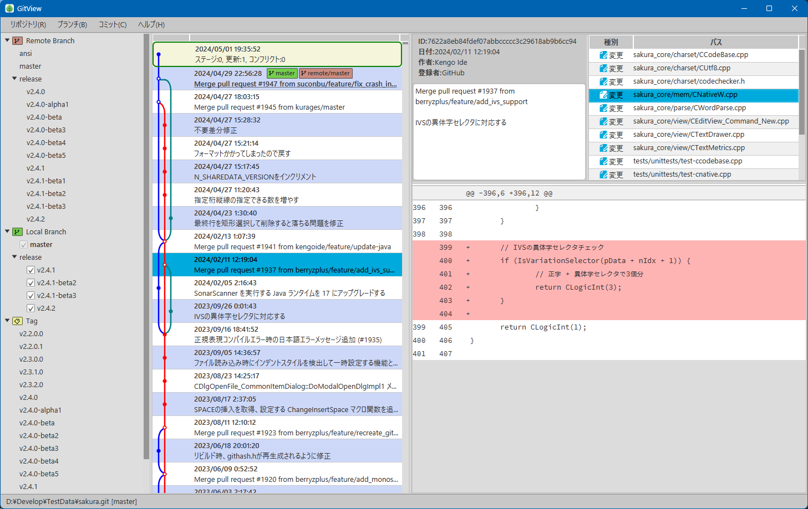
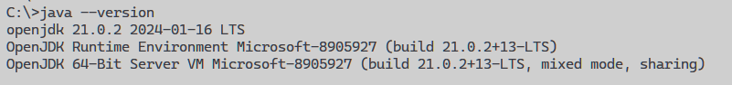

# GitView

GitView is a Git GUI client tool written in kotlin+JavaFX.

### Features

* Written entirely in [Kotlin](https://kotlinlang.org/)
* Uses [JavaFX(OpenJfx)](https://openjfx.io/) for GUI and [JGit](https://github.com/eclipse-jgit/jgit) as Git library
* Runs on JVM, so it can run in any environment (it should).

### Operating conditions

Developed using JDK21. Please prepare an environment where Java21 is available for execution.

The program is developed on Windows using [Microsoft Build of OpenJDK](https://learn.microsoft.com/ja-jp/java/openjdk/).
It should work on Linux and Mac if you prepare the same environment
(only Linux has been confirmed, although).

### How to run

1. Extract the published Zip file to a suitable location.
2. Run *gitview.bat* (Windows) or *gitview* (other) under the bin directory.
3. A blank window will open, so you can "create" or "clone" the repository. Specify the source of the clone by URL.

### Notes, etc.

* I don't think anyone will use this for work, but I would like to warn you not to operate important repositories.
* If you think it is interesting from a programming perspective or other, please contact me.

Thank you.